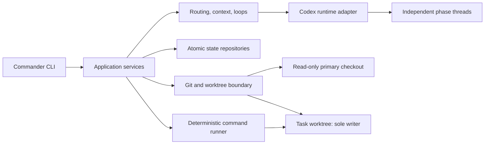

# Architecture

Codex Orchestrator is a local, stateful coordinator around the Codex SDK. Its central invariant is
that model output is advisory until it passes domain validation and deterministic repository checks.



## Layers

- `src/domain` owns strict Zod schemas and durable types for projects, tasks, evidence, executions,
  usage, diagnosis, diffs, verification, review, and audit artifacts.
- `src/application` implements use cases: configuration, doctor, registration, task phases,
  reporting, control, cleanup, repository audit, and skills.
- `src/orchestration` owns state transitions, stop policies, context construction and integrity,
  budgets, model routing, escalation, and bounded parallel reads.
- `src/infrastructure` wraps the SDK, Git, literal process execution, safe paths, atomic JSON, locks,
  and redacted logs.
- `src/cli` maps Commander input to application services and stable JSON/human output.

## Phase isolation

Normalization, diagnosis, implementation, review, audit, correction, and parallel reads create
separate execution records and event logs. Major phases always start fresh SDK threads. Review never
continues a writer thread. A structured-output repair, when required, uses a fresh minimal-reasoning
thread containing only the invalid output and validation failure.

Read-only roles receive `sandboxMode: read-only`. Implementers and correctors receive
`workspace-write` with the task worktree as their working directory. The SDK Git safety check stays
enabled for every role. Normalization is anchored to the registered Git root but receives only raw
feedback in its prompt and is forbidden from repository inspection.

## Durable state

State defaults to `~/.codex-orchestrator` and can be relocated with
`CODEX_ORCHESTRATOR_HOME`. Writes use locked, validated, atomic replacement. Task mutations use a
monotonic revision compare-and-swap so a stale agent cannot overwrite a concurrent cancellation.
Per-task operation locks prevent resume while an old process is unwinding, and per-project writer
locks preserve the one-writer rule. Project-operation locks prevent intake from racing registration
removal.

```text
CODEX_ORCHESTRATOR_HOME/
├── config.yaml, projects.json, tasks.json, task-counters.json
├── locks/
├── worktrees/<project-id>/<task-id>/
└── projects/<project-id>/
    ├── project.json, project-config.yaml, knowledge/
    └── tasks/<task-id>/
        ├── task.json, state.json, original-feedback.md
        ├── normalization-plan.json, evidence.json, usage.json
        ├── diagnosis.json, diff.json, diff.patch, verification.json, review.json
        └── context-packs/, runs/ (attempts and results), logs/, decisions.json
```

Repository knowledge consists of five commit-scoped artifacts plus a hash manifest. Task reports
aggregate the normalized task, lifecycle, attempts, phase/model usage, routing decisions, diagnosis,
diff, verification, and review while checking cross-artifact identities.

`project-config.yaml` is the human-editable verification and name-only environment allowlist.
Registration generates verification entries from non-executed stack detection; only the narrowly
safe exact `node --test` case starts approved. Environment values never enter state. Each project
lookup strictly validates the file and overlays it onto durable metadata, while refreshes preserve
user policy edits.

The application owns parallelism. Task phases may partition independent reports/files into bounded
depth-one readers, then inject only validated, deduplicated evidence into the main phase. One writer
still owns the worktree; native SDK subagents are disabled.

## Trust boundaries

Codex output cannot declare tests passed, decide the real changed files, or approve its own diff.
Git captures and hashes the actual patch. The verification subsystem executes only registered,
approved argv. A new reviewer receives that exact patch, source commit, deterministic verification,
acceptance criteria, and evidence. Completion requires a compatible approved review.
